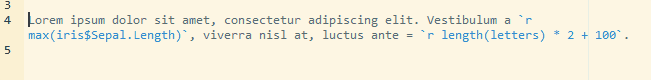
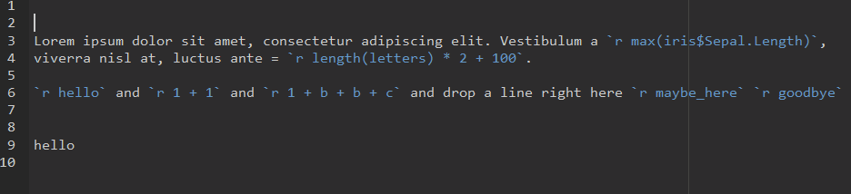

# WrapRmd

An [RStudio Addin](https://rstudio.github.io/rstudioaddins/) to wrap paragraphs
of RMarkdown text without inserting line breaks into inline R code.

## Installation

You can install the plain version WrapRmd from GitHub with:

``` r
# install.packages("devtools")
devtools::install_github("tjmahr/WrapRmd")
```

This package used the
[commonmark](https://cran.r-project.org/web/packages/commonmark/index.html)
package to wrap and reformat to markdown text. Using commonmark means that it
can wrap links and markdown lists. The package does some additional work to
handle inline R Markdown.

## Overview

Here is some nice looking RMarkdown:

```
Lorem ipsum dolor sit amet, consectetur adipiscing elit. Vestibulum a `r max(iris$Sepal.Length)`, viverra nisl at, luctus ante = `r length(letters) * 2 + 100`.
```

You highlight the text, and hit `Ctrl/Cmd + Shift + /` to wrap the text and get:

```
Lorem ipsum dolor sit amet, consectetur adipiscing elit. Vestibulum a `r
max(iris$Sepal.Length)`, viverra nisl at, luctus ante = `r length(letters) * 2 +
100`.
```

This RStudio Addin wraps text, but doesn't insert line breaks into inline R
code, yielding:

```
Lorem ipsum dolor sit amet, consectetur adipiscing elit. Vestibulum
a `r max(iris$Sepal.Length)`, viverra nisl at, luctus ante =
`r length(letters) * 2 + 100`.
```



## Notes

Then go to Tools > Addins in RStudio to select and configure addins. I've mapped 
this one addin to the shortcut `Ctrl + Shift + Alt + /`.

The package wraps lines using a maximum width set by `options("WrapRmd.width")`
which currently defaults to `80` characters.

It should work on multiple paragraphs:


