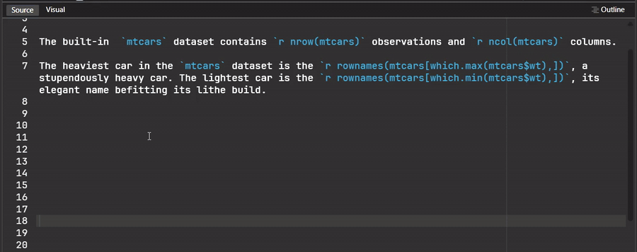
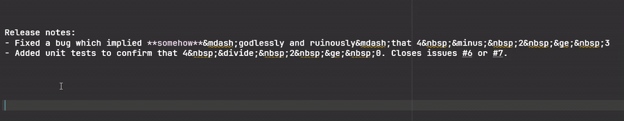
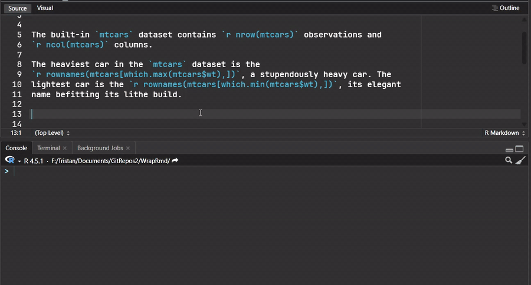
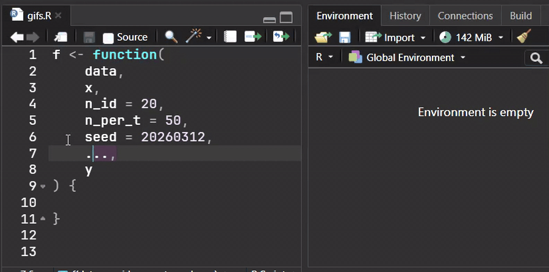

# WrapRmd

An [RStudio Addin](https://rstudio.github.io/rstudioaddins/) to wrap paragraphs
of RMarkdown text without inserting line breaks into inline R code.



## Installation

You can install the plain version WrapRmd from GitHub with:

``` r
# install.packages("devtools")
devtools::install_github("tjmahr/WrapRmd")
```

## Overview

Here is some nice looking RMarkdown:

```
Lorem ipsum dolor sit amet, consectetur adipiscing elit. Vestibulum a `r max(iris$Sepal.Length)`, viverra nisl at, luctus ante = `r length(letters) * 2 + 100`.
```

If we highlight the text and call the Wrap Rmd addin, we get the following:

```
Lorem ipsum dolor sit amet, consectetur adipiscing elit. Vestibulum a
`r max(iris$Sepal.Length)`, viverra nisl at, luctus ante =
`r length(letters) * 2 + 100`.
```

Importantly, there is *no* line break inserted inside of the inline R code
`r max(iris$Sepal.Length)`, meaning that wrapping the text will not break 
inline R code.

### Normalization

This package uses
[commonmark](https://cran.r-project.org/web/packages/commonmark/index.html) to
wrap and reformat markdown text. This pipeline is advantageous because
commonmark handles the difficult work of parsing the markdown text. But because
wrapping goes through commonmark, selected text may be normalized or escaped
during rewrapping. What this package provides is some additional work to handle
inline R Markdown and to undo some of the commonmark normalization that
conflicts with RMarkdown features.

In the following animation, we can see three (useful) commonmark normalizations:
HTML entities are converted into proper characters, the text in the list is
wrapped and cleaned up, and the issue numbers get an escape on the `#`
character.




### Other notes

There are two ways to run or view addins.

1.  Tools > Addins, to view addins, run them, or set keyboard shortcuts.

2.  Tools > Show Command Palette, then start typing the name of the addin to
    run. As a reminder, the Command Palette's keyboard shortcut is
    `Ctrl+Shift+P` or `Cmd+Shift+P`.

The package wraps lines using a maximum width set by `options("WrapRmd.width")`
which currently defaults to `80` characters.

## Bonus Addins

**Flip Backslashes to Forward Slashes**: Converts Windows-style backslashes
(`\`) to forward slashes (`/`) in the current selection.

**Knit Selection**: Runs the selected text through knitr/commonmark to
preview what the rendered markdown/html output will look like.



**Assign argument defaults**: Evaluates comma-separated `x = y` expressions in
the current selection and assigns each value in the global environment.

Note how the environment pane populates with new variables in this example:



