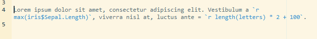
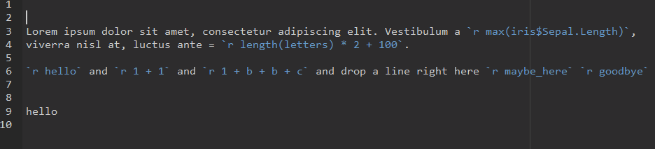

# WrapRmd

An [RStudio Addin](https://rstudio.github.io/rstudioaddins/) to wrap paragraphs
of RMarkdown text without inserting line breaks into inline R code.

## Installation

You can install the plain version WrapRmd from GitHub with:

``` r
# install.packages("devtools")
devtools::install_github("tjmahr/WrapRmd")
```

This package uses
[commonmark](https://cran.r-project.org/web/packages/commonmark/index.html)
to wrap and reformat markdown text. Because wrapping goes through commonmark,
selected text may be normalized/reformatted during rewrapping (for example, in
links or list formatting). The package does some additional work to handle
inline R Markdown.

## Overview

Here is some nice looking RMarkdown:

```
Lorem ipsum dolor sit amet, consectetur adipiscing elit. Vestibulum a `r max(iris$Sepal.Length)`, viverra nisl at, luctus ante = `r length(letters) * 2 + 100`.
```

You highlight the text, and hit `Ctrl/Cmd + Shift + /` to wrap the text and get:

```
Lorem ipsum dolor sit amet, consectetur adipiscing elit. Vestibulum a `r
max(iris$Sepal.Length)`, viverra nisl at, luctus ante = `r length(letters) * 2 +
100`.
```

This RStudio Addin wraps text, but doesn't insert line breaks into inline R
code, yielding:

```
Lorem ipsum dolor sit amet, consectetur adipiscing elit. Vestibulum
a `r max(iris$Sepal.Length)`, viverra nisl at, luctus ante =
`r length(letters) * 2 + 100`.
```



## Notes

Then go to Tools > Addins in RStudio to select and configure addins. You
can also browse and run them from Tools > Show Command Palette with
`Ctrl+Shift+P` (Windows/Linux) or `Cmd+Shift+P` (macOS).

The package wraps lines using a maximum width set by `options("WrapRmd.width")`
which currently defaults to `80` characters.

It should work on multiple paragraphs:



## Bonus Addins

- `knit_selection`: Runs the selected text through knitr/commonmark so you can
  preview what the rendered markdown/html output will look like.
- `flip_backslashes`: Converts Windows-style backslashes (`\`) to forward
  slashes (`/`) in the current selection.
- `assign_argument_defaults`: Evaluates comma-separated `x = y` expressions in
  the current selection and assigns each value in the global environment.
